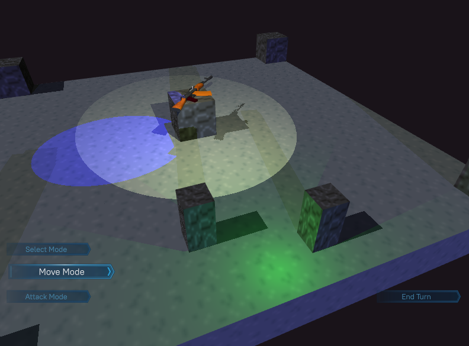

# Gridstate Engine #
### Graphics Demo ###

This project was intended to be an engine for turn-based tactics games and/or CRPGs with turn based combat.
The **master** branch also contains a test game.

This branch (**graphics-demo**) contains a test scene showcasing the rendering system, including dynamic lighting
and shadows that work with all three standard types of lights.

Only works on Windows due to certain libraries being DLLs. Can be built with Visual Studio 2022.

## Frameworks/Libraries Used ##
- OpenGL
- GLFW
- glad
- glm
- assimp
- stb_image
- OpenAL
- libsndfile
- NoesisGUI

## Group Composition
- Max
- Joe
- Anthony
- Shendao
- Daniil
- Gurjot
- Mike
- Calvin
- Winston
- Harley
- Joshua

## Architecture

This engine, generally speaking, uses an ECS. Entities are nothing more than integer indices that tie 
certain components together. There is no inheritance at all whatsoever between components. Anything can
thus be made a component if you aren't careful.

### Universe
The "Universe" system serves as a gateway that essentially takes orders on what to render
from various subsystems like the game logic, game object list and/or the conceptualized but unlikely to
be implemented continious-space physics subsystem. It also translates various positioning information 
from the discrete grid used by game logic to continious 3d space coordinates used by the graphics. 

### Graphics
Due to the nature of this project, the graphics system is designed to be as easy to use and as hard to
accidentally break as possible. To this end, everything is built around a Renderer god-class that handles
practically all interaction with the OpenGL backend. This makes the process of what actually goes on when
working with OpenGL a lot easier to follow if you don't already know what it's *supposed* to do.

There are also classes for various logical groups that describe certain things, such as the way a mesh is 
stored in OpenGL memory. They serve as datastores and are populated by the Renderer, which creates the 
relevant OpenGL objects and stores them. As an added bonus, if we end up moving away from the god-class 
architecture, they will provide a good scaffolding to build the self-loading classes.

The string-map system serves the same purpose: it's easier to work with once finished. Assigning easy 
human-readable names to things makes life a lot easier for whoever will end up designing the game itself.
The performance impacts are negligible at our scale.

Generally speaking, processing efficiency is prioritized over memory efficiency when it comes to graphics,
especially since most work machines only have integrated graphics and our meshes are extremely simplistic
and few in number.

### UI
UI is handled by the NoesisGUI API running on a trial license. Everything about it, including the NSGUI
setup process and trial key, has been moved to the UIController class.
